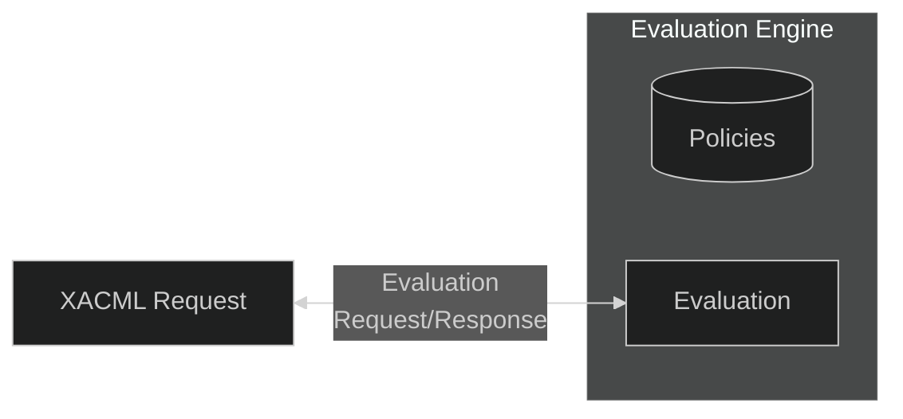

# Contact me

To effectively control who gets access to resources, **PJD.XcaDocumentSource** implements the P*P pattern for access control and authorization (PEP, PDP, PR), leveraging standards like **XACML Version 2.0** - part of the broader **Identity and Access Management (IAM)** domain.  

See [Xacml 2.0 Core Spec (PDF) - docs.oasis-open.org ↗](https://docs.oasis-open.org/xacml/2.0/access_control-xacml-2.0-core-spec-os.pdf) for more info.

## Authorization flow

```json
%%{init: {'theme':'dark'}}%%

flowchart LR


in[Incoming Request]

subgraph "PJD.XcaDocumentsource"
    pep["PEP<br>(2.) | (6.)"]
    pdp{PDP}
    pr[(&nbsp;&nbsp;PR&nbsp;&nbsp;)]
    ep((API-endpoint))
end

in  --1\.--> pep
pep --3\.--> pdp
pdp --4\.--> pr
pr  --> pdp
pdp --5\.--> pep
pep --6.1\.----> ep
pep --6.2\.--> in
```

### Explanation
&emsp;1.&nbsp;*A request is sent to one of **PJD.XcaDocumentSource's** endpoints which uses **Policy Enforcement Point (PEP)*** 

&emsp;2.&nbsp;*The **PEP** Extracts a Xacml V2.0 request from the requests authorization details (ie. SAML-token in a SOAP-envelope or JWT in HTTP headers)*

&emsp;3.&nbsp;*The **PEP** sends the request to the **Policy Decision Point (PDP)***

&emsp;4.&nbsp;*The **PDP** queries - or has cached - The **Policy Repository (PR)***

&emsp;5.&nbsp;*The **PDP** has evaluated the request against the policies in the Repository and sends the decision result back to the Policy Enforcement Point*

&emsp;6.&nbsp;*The **PEP** receives the decision response.*

&emsp;6.1.&nbsp;*The **PEP** sends the request on to the API-endpoint*  

&emsp;6.2.&nbsp;*The **PEP** denies the request*

## Requests and Policies
In the user authorization domain, there are three parts; the Requests, the Policies and the Evaluation Engine.
The Evaluation Engine contains the Policies, and is able to validate an incoming Request based on this.



## Policy Enforcement Point
**The Policy Enforcement Point** (PEP) sits in front of an API-endpoint (such as the SOAP-endpoints) and intercepts (enforces a policy upon) the request by parsing the authentication details from the request and sending it to the Policy Decision Point (PDP), to authorize the request.
